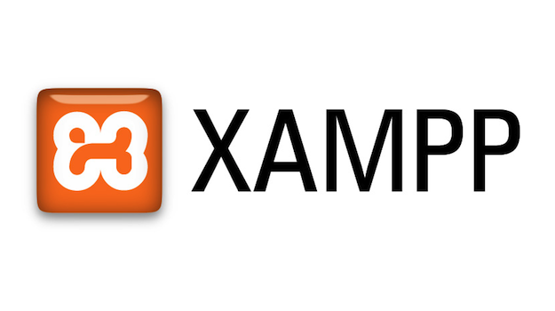

# Descripción
 Dentro de este proecto se pueden observar los requerimientos para lograr que al buscar biblioteca.dev aperzca el archivo del primer parcial.

 ## Requerimientos 
 Lista de requerimientos de software para el funcionamiento del proyecto:

 
1. PHP -5.6.31 [Descargar] 
  (Http://php.net/download)
3. elemento 3
> Se recomienda utilizar XAMPP [ir al sitio oficial de XAMPP]
  (http://apachefriends.org)

>+ Servidor web 
>+ Servidor de aplicaciones 
>+ Servidor de Base de Datos

## Instalación de requerimientos 

1. **Como instalar XAMPP**:

>pasos para instalar los requerimientos en caso de ser necesario:
1. una vez que tengas descargado xampp, comienza la instalación haciendo click en ejecutar.
2. Acepta la configuración predeterminada. Un comando se abrirá y te ofrecerá una instalación inicial. Simplemente presiona Enter y acepta la configuración predeterminada. Para hace más fácil la instalación, simplemente pulsa Enter cada vez que se te indique en la línea de comandos. La configuración puede ser cambiada en cualquier momento en la edición de los archivos de configuración. 
3. Para concluir con la instalación solo debes dar click en el boton finish.

**Instalación del proyecto:** 
 Pasos para instalar el proyecto en PHP con MYSQL que tenemos de prestamo de libros.
 ### Clonar el repositorio 
 1. entrar a Git Hub y buscar el repositorio que desees clonar.
 2. una vez tengas seleccionado seleccionas el boton que dice: *clone or download*.  
 3. una vez ya seleccionado el boton aparecera una ventana la cual contiene 2 botones debajo uno para abrir en desktop y la otra para descargar, en este caso utilizaremos para abrir en desktop, así que seleccionas el boton que dice: *Open in Desktop*.
 
 4. Después de haber seleccionado el boton te aparecerá una ventanilla en la cual deberas seleccionar una aplicación utilizaremos **GitHubDesktop.exe**, así que la seleccionas y le das click en: *Abrir enlace*. 
 5. Como ultimo paso te abrirá el GitHubDesktop y te mostrará una ventanilla en la que te dirá el nombre del repositorio, al lugar y  la carpeta que irá, en esa parte puedes modificar el nombre de la carpeta si asi lo deseas luego das click en *clone* y comenzará la clonación.
 
 
 
 ## Pruebas
 
 Entrar en el navegador y buscar biblioteca.dev.
 

 ## Instalación de la base de datos
 Utilizando el archivo 
 *biblioteca.sql*
 -  Abrir MYSQL 
  
 -  Entrar a la conexión 
  
 -  Abrir el archivo bibliotecam.sql 
  
 -  Por ultimo lo ejecutas 
  

  **Configuración del proyecto**
  - 
  + DNS LOCAL (biblioteca.dev)
  + APACHE GLOBAL (httpd.conf):
  1. Abres el explorador de windows y abres el documento: *httpd.conf* este se encuentra en : c:\xampp\apache\conf.
  
  2. Luego escribes el codigo necesario.
  3. Guardas el archivo

  + APACHE VHOSTS (httpd-vhosts.conf):
   1. Abres el explorador de windows y buscas el documento *httpd-vhosts.conf* que se encuentra en el disco local c:-xampp-apache-conf-extra 
   2. una vez abierto comienzas a escribir los datos que necesitas: 
   <VirtualHost 127.0.0.1:90>
    ServerAdmin aqui va el correo
    DocumentRoot la ruta del documento
    ServerName  nombre del server ejemplo biblioteca.dev
    ErrorLog "logs/biblioteca.dev-error.log"
    CustomLog "logs/biblioteca.dev-access.log" common
    <Directory />
      Options All
      AllowOverride All 
      Require all granted
    </Directory>
    </VirtualHost>
   3. Por ultimo guardas los cambios
        
> cuando guardas uno de estos archivos es necesario que reinicie xampp, esto se puede hacer deteniendo y volviendolo a ejecutar
    

##USO DEL PROYECTO 
- 
Abres el navegador y escribes biblioteca.dev y LISTO! :D